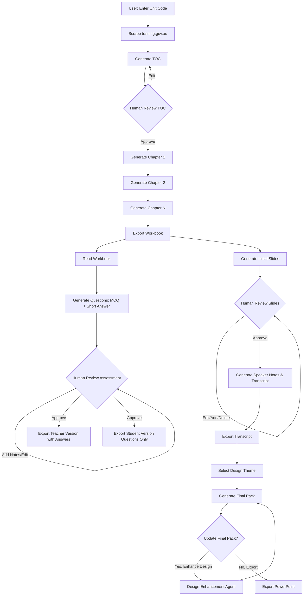

# TAFE GEN - Intelligent TAFE Content Generator


**TAFE GEN** is an intelligent agentic platform that automates the creation of compliance-ready curriculum materials for Australian Vocational Education and Training (VET) institutions. Transform curriculum development from **40+ hours** to **minutes** while ensuring 100% ASQA compliance.

---

## 📋 Table of Contents

- [Getting Started](#-getting-started)
- [Environment Setup](#-environment-setup)
- [Usage Guide](#-usage-guide)
- [The Problem](#-the-problem)
- [The Solution](#-the-solution)
- [Why Agents?](#-why-agents)
- [Architecture](#-architecture)
- [Key Features](#-key-features)
- [Tech Stack](#-tech-stack)
- [API Documentation](#-api-documentation)
- [Project Structure](#-project-structure)
- [Value Proposition](#-value-proposition)
- [Deployment](#-deployment)
- [AI Agent Concepts](#-ai-agent-concepts)
- [Contributing](#-contributing)
- [Roadmap](#-roadmap)

---

## 🚀 Getting Started

### Prerequisites

- **Node.js** 18.0 or higher
- **npm** or **yarn**
- **Google Gemini API Key** (Get one at [Google AI Studio](https://aistudio.google.com/))

### Quick Start

1. **Clone the repository**
   ```bash
   git clone <repository-url>
   cd TAFE-Educator-Content-Generator
   ```

2. **Install dependencies**
   ```bash
   npm install
   ```

3. **Set up environment variables**
   
   Create a `.env.local` file in the root directory:
   ```env
   GEMINI_API_KEY=your_gemini_api_key_here
   ```

4. **Add template files (Optional)**
   
   Template files are located in the `examples/` directory:
   - `examples/Template_WB.docx` - Template workbook structure
   - `examples/UEEEIC0010_WB.docx` - Example workbook for style reference

5. **Run the development server**
   ```bash
   npm run dev
   ```

6. **Open your browser**
   
   Navigate to [http://localhost:3000](http://localhost:3000)

🎉 **You're ready to go!** Start by searching for a TAFE unit code to generate your first workbook.

---

## 🔐 Environment Setup

### Required Environment Variables

| Variable | Description | Where to Get It |
|----------|-------------|-----------------|
| `GEMINI_API_KEY` | Google Gemini API Key for AI generation | [Google AI Studio](https://aistudio.google.com/) |

### Setting Up Your API Key

#### Local Development

Create a `.env.local` file in the root directory:

```env
GEMINI_API_KEY=your_gemini_api_key_here
```

#### Production (Vercel)

1. Go to [Vercel Dashboard](https://vercel.com/dashboard)
2. Select your project
3. Navigate to **Settings** → **Environment Variables**
4. Add `GEMINI_API_KEY` with your API key
5. Select all environments (Production, Preview, Development)
6. Save and redeploy

### Optional Configuration

For enhanced features, you may need:
- `config/lab-hweng-vv5e3f7cc6-d0c169fff1d7.json` - Google Cloud credentials (for Slides API integration)

---

## 📖 Usage Guide

### Generating a Workbook

1. **Navigate to Workbook Generator**
   - Click "Start a Workbook" from the homepage
   - Or go to `/workbook`

2. **Search for Unit**
   - Enter a Unit Code (e.g., `UEECD0014`)
   - Click "Create"
   - Select the correct unit from results

3. **Upload Resources (Optional)**
   - Drag and drop additional reference materials
   - Supported formats: PDF, DOCX, TXT

4. **Generate Structure**
   - Click "Generate Workbook Structure"
   - Wait for AI to scrape training.gov.au
   - Review the proposed Table of Contents

5. **Customize TOC**
   - ✏️ Edit chapter titles
   - ➕ Add new chapters
   - ➖ Remove irrelevant sections

6. **Generate Content**
   - Click "Confirm & Generate Workbook"
   - Monitor progress as each chapter is generated
   - Download the final DOCX file

### Generating Assessments

1. **Navigate to Assessment Generator** (`/assessment`)
2. **Upload Workbook** (DOCX file)
3. **Click "Generate Assessment"**
4. **Review Questions** (Edit if needed)
5. **Download:**
   - Student version (questions only)
   - Teacher version (with answers)

### Generating Slides

1. **Navigate to Slides Generator** (`/slides`)
2. **Upload Teaching Materials**
3. **Click "Generate Slide Outline"**
4. **Review and Edit Slides**
5. **Optional:** Enhance Design with AI
6. **Download PowerPoint File**

---

## 🚨 The Problem

### Manual Curriculum Development is Broken

The Australian VET sector faces a critical operational bottleneck: **highly qualified educators spend more time on compliance paperwork than teaching**.

#### The Current Manual Process

1. **Regulatory Research (5-8 hours)**
   - Navigate to [training.gov.au](https://training.gov.au)
   - Manually copy-paste *Elements and Performance Criteria*
   - Extract *Foundation Skills*, *Knowledge Evidence*, and *Assessment Conditions*

2. **Curriculum Mapping (8-12 hours)**
   - Map government standards to lesson plans
   - Ensure every single criterion is covered

3. **Content Drafting (20-25 hours)**
   - Write 50-70 pages of content from scratch
   - Google for Australian-specific industry examples
   - Create classroom activities

4. **Assessment Creation (7-10 hours)**
   - Write 25+ multiple choice questions
   - Create 30+ short answer questions
   - Cross-reference answers with workbook content

**Total Time:** ~40 hours per unit  
**Outsourced Cost:** $3,600 - $4,000 AUD per unit  
**Qualification Cost (15 units):** $54,000 - $60,000 AUD  

### The Compliance Risk

Manual creation increases the risk of **non-compliance** where learning materials fail to map strictly to government-mandated Performance Criteria, potentially risking institutional accreditation during ASQA audits.

---

## 💡 The Solution

**TAFE GEN** transforms curriculum development through an intelligent, multi-agent workflow that:

✅ **Scrapes live data** from training.gov.au for 100% accuracy  
✅ **Generates 50-70 page workbooks** with Australian industry context  
✅ **Creates mapped assessments** (25 MCQs + 30 Short Answer)  
✅ **Produces presentation slides** with speaker notes and transcripts  
✅ **Ensures compliance** with the latest ASQA standards  
✅ **Includes human-in-the-loop** checkpoints for educator control  

### The Impact

- **⏱️ Time Savings:** 40 hours → ~2 hours (95% reduction)
- **💰 Cost Savings:** $4,000 → ~$100 per unit (97.5% reduction)
- **📊 Scale:** 4,500+ RTOs in Australia
- **✅ Quality:** Zero hallucination through grounded generation

---

## 🤖 Why Agents?

Traditional LLMs can't handle TAFE curriculum generation because:

| Challenge | Traditional LLM | TAFE GEN Agentic Approach |
|-----------|----------------|---------------------------|
| **Data Accuracy** | Hallucinations from static training data | **Live web scraping** from training.gov.au |
| **Output Length** | Token limits (4K-8K) | **Iterative generation** with chapter-by-chapter approach |
| **User Trust** | Black box "prompt & pray" | **Human-in-the-loop** TOC review before generation |
| **Consistency** | Assessment questions may not match content | **Sequential agents** ensure assessments derive from actual workbook |
| **Context Management** | Loses focus over long documents | **Stateful agents** maintain context across 70+ pages |

### Agent Workflow



### The Core Agents

1. **Research Agent** (Grounding)
   - Scrapes training.gov.au in real-time
   - Extracts Performance Criteria, Elements, and Knowledge Evidence
   - Builds context-specific knowledge base

2. **Planning Agent** (Strategic Planning)
   - Generates structured Table of Contents
   - Maps Performance Criteria to chapters
   - Enables human-in-the-loop review

3. **Writer Agent** (Content Generation)
   - Uses Retrieval Augmented Generation (RAG)
   - Generates chapters iteratively
   - Maintains Australian industry context

4. **Assessment Agent** (Consistency)
   - Ingests the generated workbook
   - Ensures questions map to learning material
   - Creates student and teacher versions

5. **Presentation Agent** (Multi-Modal Output)
   - Generates initial slide outlines
   - Creates speaker notes and transcripts
   - Supports iterative human refinement

6. **Design Enhancement Agent** (Visual Polish)
   - Applies professional themes
   - Optimizes slide layouts
   - Generates final presentation package

---

## 🏗️ Architecture

### System Overview

```
┌─────────────────────────────────────────────────────────────┐
│                      TAFE GEN Platform                      │
│                      (Next.js 16.0)                         │
└─────────────────────────────────────────────────────────────┘
                              │
                    ┌─────────┴─────────┐
                    │                   │
          ┌─────────▼────────┐  ┌──────▼─────────┐
          │   Frontend UI    │  │   API Routes   │
          │   (React 19)     │  │   (Next.js)    │
          └──────────────────┘  └────────────────┘
                                        │
                    ┌───────────────────┼───────────────────┐
                    │                   │                   │
            ┌───────▼────────┐  ┌──────▼──────┐   ┌───────▼────────┐
            │  Scraper Agent │  │Writer Agent │   │Assessment Agent│
            │  (Cheerio +    │  │(Gemini 3.0) │   │  (Gemini 3.0)  │
            │   Gemini)      │  └─────────────┘   └────────────────┘
            └────────────────┘          │
                    │                   │
            ┌───────▼────────┐  ┌──────▼──────────────────┐
            │training.gov.au │  │  Document Generation    │
            │  (Live Data)   │  │  (DOCX, PPTX Export)   │
            └────────────────┘  └─────────────────────────┘
```

### Agent Architecture Details

#### 1. Research Agent (`/api/scrape`)
- **Input:** Unit Code or training.gov.au URL
- **Process:**
  1. Web scraping with Cheerio
  2. Content extraction and cleaning
  3. Gemini 3.0 structured analysis
  4. TOC generation based on Performance Criteria
- **Output:** Structured unit data + proposed chapter outline

#### 2. Writer Agent (`/api/generate-chapter`)
- **Input:** Chapter title + Unit context
- **Process:**
  1. Contextual prompt generation
  2. Australian-specific content generation
  3. Markdown formatting
- **Output:** 3-8 pages of detailed chapter content

#### 3. Assessment Agent (`/api/generate-assessment`)
- **Input:** Generated workbook content
- **Process:**
  1. Content ingestion
  2. Question generation (MCQ + Short Answer)
  3. Answer derivation from workbook
- **Output:** 25 MCQs + 30 Short Answer questions with marking guides

#### 4. Presentation Agent (`/api/generate-slides`)
- **Input:** Teaching materials/workbook
- **Process:**
  1. Content summarization
  2. Slide structure generation
  3. Speaker notes creation
- **Output:** PowerPoint with slides, notes, and transcript

---

## ✨ Key Features

### 1. 🔍 Smart Unit Search
- Search by Unit Code (e.g., "UEECD0014")
- Real-time validation against training.gov.au
- Instant preview of unit details

### 2. 📚 Automated Workbook Generation
- **Human-in-the-Loop TOC Review:** Edit, add, or remove chapters before generation
- **Chapter-by-Chapter Generation:** Progress tracking with status updates
- **Australian Context:** Industry-specific examples and regulations
- **Export Formats:** DOCX with professional formatting

### 3. 📝 Intelligent Assessment Creation
- **Mapped Questions:** Every question answerable from the workbook
- **Dual Outputs:**
  - Student version (questions only)
  - Teacher version (with answers and marking guides)
- **Compliance:** Aligned with Performance Criteria

### 4. 🎓 Presentation Generation
- **Visual Slide Decks:** Auto-generated from workbook content
- **Speaker Notes:** Detailed presenter scripts
- **Transcript Export:** Full text of presentation
- **Customizable Themes:** Professional design templates

---

## 🛠️ Tech Stack

### Frontend
- **Framework:** Next.js 16.0 (App Router)
- **UI Library:** React 19.2
- **Styling:** CSS Modules + Custom CSS Variables
- **State Management:** React Hooks

### Backend
- **Runtime:** Node.js (Next.js API Routes)
- **AI Model:** Google Gemini 3.0 Pro Preview
- **Web Scraping:** Cheerio 1.1.2

### Document Processing
- **DOCX Generation:** docx 9.5.1
- **DOCX Parsing:** mammoth 1.11.0
- **PPTX Generation:** pptxgenjs 4.0.1

### External Services
- **AI API:** Google Generative AI SDK (@google/generative-ai 0.24.1)
- **Data Source:** training.gov.au (National Training Register)
- **MCP Server:** Model Context Protocol for document-grounded slide generation

### MCP Integration

TAFE GEN uses a local **Model Context Protocol (MCP)** server for advanced slide generation capabilities. The MCP server enables:

- **Document-grounded generation** - Slides based on actual uploaded content
- **Reduced hallucination** - AI grounded in real documents
- **Extensible tools** - Easy to add custom capabilities
- **Standardized communication** - Protocol-based tool interactions

📘 **For complete MCP setup and usage:** See [docs/MCP_GUIDE.md](./docs/MCP_GUIDE.md)

**Quick Start MCP Server:**
```bash
cd mcp-server
pip install -r requirements.txt
python server.py
```

---

## 🔌 API Documentation

### POST `/api/scrape`

Scrape a training.gov.au unit page and generate TOC.

**Request:**
```javascript
const formData = new FormData();
formData.append('url', 'https://training.gov.au/Training/Details/UEECD0014');
formData.append('files', file1); // Optional
formData.append('files', file2); // Optional

fetch('/api/scrape', {
  method: 'POST',
  body: formData
});
```

**Response:**
```json
{
  "title": "UEECD0014 - Develop design briefs for electrotechnology projects",
  "chapters": [
    "1. Unit Overview & Introduction",
    "2. Module 1: Preparation and Planning",
    "3. Module 2: Developing the Design Proposal",
    "4. Module 3: Negotiation and Approval",
    "5. Knowledge Evidence Section",
    "6. Performance Evidence Section"
  ]
}
```

### POST `/api/generate-chapter`

Generate content for a single chapter.

**Request:**
```json
{
  "chapterTitle": "Module 1: Preparation and Planning",
  "unitTitle": "UEECD0014 - Develop design briefs",
  "unitCode": "UEECD0014"
}
```

**Response:**
```json
{
  "content": "## Module 1: Preparation and Planning\n\n### Introduction\n..."
}
```

### POST `/api/generate-assessment`

Generate assessment questions.

**Request:**
```json
{
  "files": ["workbook.docx"]
}
```

**Response:**
```json
{
  "title": "Assessment Task",
  "mcqs": [
    {
      "question": "What is the primary purpose of WHS legislation?",
      "options": ["A", "B", "C", "D"],
      "answer": "A"
    }
  ],
  "shortAnswer": [
    {
      "question": "Explain the critical path method...",
      "answer": "The critical path method is..."
    }
  ]
}
```

### POST `/api/export`

Export workbook to DOCX format.

**Request:**
```json
{
  "workbook": {
    "title": "Unit Title",
    "chapters": [
      {
        "title": "Chapter 1",
        "content": "Markdown content..."
      }
    ]
  }
}
```

**Response:** Binary DOCX file download

### POST `/api/generate-slides`

Generate presentation slides from content.

**Request:** FormData with uploaded file

**Response:**
```json
{
  "title": "Unit Title",
  "slides": [
    {
      "title": "Slide Title",
      "points": ["Point 1", "Point 2"],
      "infographic": "Visual description"
    }
  ]
}
```

### POST `/api/enhance-design`

Enhance slide design with AI-powered theme.

**Request:**
```json
{
  "slides": { /* slide data */ },
  "currentTheme": { /* theme data */ }
}
```

**Response:**
```json
{
  "designName": "Nano Banana Pro - Professional Blue",
  "theme": {
    "primary": "#1e40af",
    "secondary": "#3b82f6",
    "accent": "#60a5fa"
  },
  "slideDesigns": [
    {
      "slideIndex": 0,
      "layout": "centered-hero",
      "visualNotes": "Add gradient overlay..."
    }
  ]
}
```

---

## 📁 Project Structure

```
TAFE-Educator-Content-Generator/
├── src/
│   ├── app/
│   │   ├── api/                     # API Routes
│   │   │   ├── scrape/              # Research Agent
│   │   │   ├── generate-chapter/    # Writer Agent (single chapter)
│   │   │   ├── generate/            # Writer Agent (full workbook)
│   │   │   ├── generate-assessment/ # Assessment Agent
│   │   │   ├── generate-slides/     # Presentation Agent (initial)
│   │   │   ├── generate-final-slides/ # Presentation Agent (enhanced)
│   │   │   ├── generate-images/     # Image generation
│   │   │   ├── enhance-design/      # Design enhancement
│   │   │   ├── export/              # DOCX export
│   │   │   ├── export-assessment/   # Assessment export
│   │   │   ├── export-slides/       # PPTX export
│   │   │   ├── export-transcript/   # Transcript export
│   │   │   └── search/              # Unit code search
│   │   ├── workbook/                # Workbook generation page
│   │   ├── assessment/              # Assessment generation page
│   │   ├── slides/                  # Slides generation page
│   │   ├── layout.js                # Root layout
│   │   ├── page.js                  # Homepage
│   │   └── globals.css              # Global styles
│   ├── components/
│   │   └── Navbar.js                # Navigation component
│   ├── data/
│   │   └── prompts.js               # AI prompt templates
│   └── lib/
│       └── googleSlides.js          # Google Slides integration
├── public/                          # Static assets
├── mcp-server/                      # MCP server (future feature)
├── examples/                        # Example templates and files
│   ├── Template_WB.docx             # Workbook template
│   ├── UEEEIC0010_WB.docx          # Example workbook
│   └── The Australian Energy Sector.pptx # Sample presentation
├── scripts/                         # Development and test scripts
│   ├── check_mcp.py                 # MCP server check
│   ├── debug_tga.js                 # Debug script
│   ├── test_search.js               # Search functionality test
│   └── list_models.js               # List available AI models
├── docs/                            # Documentation
│   └── INSTRUCTIONS.md              # Setup instructions
├── config/                          # Configuration files
│   └── lab-hweng-*.json             # Google Cloud credentials
├── package.json                     # Dependencies
├── next.config.mjs                  # Next.js configuration
├── vercel.json                      # Vercel deployment config
└── README.md                        # This file
```

---

## 💰 Value Proposition

### The Scale of the Problem

According to the National Training Register:
- **4,500+ Registered Training Organisations** (RTOs) in Australia
- **Average qualification:** 15 Units of Competency
- **Manual development cost:** $54,000 - $60,000 per qualification
- **Staff time:** 600+ hours per qualification

### TAFE GEN Impact

| Metric | Manual Process | With TAFE GEN | Savings |
|--------|---------------|---------------|---------|
| **Time per Unit** | 40 hours | 2 hours | 95% ⬇️ |
| **Cost per Unit** | $3,600-$4,000 | ~$100 | 97.5% ⬇️ |
| **Qualification Cost** | $54,000-$60,000 | ~$1,500 | 97.5% ⬇️ |
| **Staff Hours** | 600 hours | 30 hours | 95% ⬇️ |

### Quality Improvements

✅ **Zero Non-Compliance Risk:** Live data from training.gov.au  
✅ **Always Up-to-Date:** Latest Performance Criteria  
✅ **Consistent Quality:** AI-powered consistency checks  
✅ **Australian Context:** Industry-specific examples  
✅ **Audit-Ready:** Mapped to government standards  

### Market Opportunity

- **Total Addressable Market:** 4,500+ RTOs × $60k avg = $270M+ AUD annually
- **Immediate ROI:** First unit pays for itself in time savings
- **Scalability:** Unlimited units without additional labor cost

---

## 🚀 Deployment

For complete deployment instructions, including reproducible deployment steps, see **[docs/DEPLOYMENT.md](./docs/DEPLOYMENT.md)**.

### Quick Deploy (Vercel)

1. **Push to GitHub**
   ```bash
   git push origin main
   ```

2. **Import to Vercel**
   - Go to [vercel.com](https://vercel.com)
   - Click "New Project"
   - Import your repository

3. **Configure Environment Variables**
   - Add `GEMINI_API_KEY` in Vercel dashboard
   - Settings → Environment Variables → Add New
   - Set for Production, Preview, and Development

4. **Deploy**
   - Vercel will automatically build and deploy
   - Your app will be live at `https://tafe-educator-content-generator.vercel.app/`

### Manual Deployment

1. **Build the application**
   ```bash
   npm run build
   ```

2. **Start production server**
   ```bash
   npm start
   ```

📘 **For detailed deployment instructions:** See [docs/DEPLOYMENT.md](./docs/DEPLOYMENT.md)

---

## 🤖 AI Agent Concepts

TAFE GEN demonstrates advanced AI agent patterns and concepts:

### Implemented Concepts

✅ **Multi-Agent System**
- Sequential agents (Research → Planning → Writer → Assessment/Presentation)
- Loop agents (Iterative chapter generation)
- Specialized domain agents (6 agents)

✅ **Tools Integration**
- Custom tools (Web scraping with Cheerio)
- Built-in tools (Google Gemini 3.0 Pro)
- Document processing (DOCX/PPTX generation)

✅ **Session & State Management**
- React state management
- API context passing
- Human-in-the-loop checkpointing

✅ **Context Engineering**
- RAG implementation with template files
- Context compaction (structured prompts)
- Dynamic context building from live data

✅ **Observability**
- Comprehensive logging
- Real-time progress tracking
- Error handling and user feedback

📘 **For detailed concept documentation:** See [docs/AGENT_CONCEPTS.md](./docs/AGENT_CONCEPTS.md)

---

## 🤝 Contributing

This is a proprietary project. For internal development:

1. **Create a feature branch**
   ```bash
   git checkout -b feature/your-feature-name
   ```

2. **Make your changes**
   - Follow existing code style
   - Test thoroughly
   - Update documentation

3. **Commit your changes**
   ```bash
   git commit -m "Add: your feature description"
   ```

4. **Push and create PR**
   ```bash
   git push origin feature/your-feature-name
   ```

---

## 🎯 Roadmap

### Current Version (v1.0)
- ✅ Workbook generation with live data scraping
- ✅ Assessment creation with dual output
- ✅ Slides generation with theme customization
- ✅ ASQA compliance checking
- ✅ Human-in-the-loop review workflows

### Upcoming Features (v2.0)
- 🔄 Batch processing (multiple units at once)
- 🔄 Version control for workbooks
- 🔄 Collaboration features (multi-user editing)
- 🔄 LMS integration (Moodle, Canvas)
- 🔄 Advanced analytics dashboard
- 🔄 Custom branding for RTOs
- 🔄 Multi-language support
- 🔄 Automated quality assurance scoring

---

## 📄 License

Proprietary. All rights reserved.

---

## 📞 Support

For questions or support, contact:
- **Email:** support@tafegen.com.au
- **Documentation:** [docs.tafegen.com.au](https://docs.tafegen.com.au)
- **Live Demo:** [https://tafe-educator-content-generator.vercel.app/](https://tafe-educator-content-generator.vercel.app/)

---

## 🙏 Acknowledgments

- **TAFE NSW** - For invaluable feedback on curriculum requirements
- **Australian Skills Quality Authority (ASQA)** - For compliance standards
- **Google Gemini Team** - For powerful AI capabilities
- **training.gov.au** - For providing the National Training Register

---

<div align="center">

**Built with ❤️ for Australian TAFE Educators**

[Homepage](https://tafe-educator-content-generator.vercel.app/) · 
[Documentation](https://docs.tafegen.com.au) · 
[Report Bug](mailto:support@tafegen.com.au)

</div>
